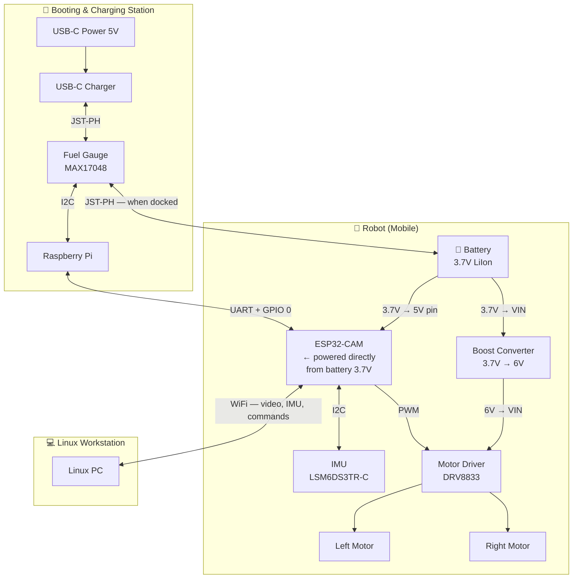

# ROSS

## Overview

Three physically distinct subsystems:

| Subsystem | Hardware | Role |
|-----------|----------|------|
| **Robot** | ESP32-CAM, IMU, Motor Driver, Boost Converter, 2× Motors, LiIon Battery | Mobile platform — streams video and IMU data over WiFi; drives motors on command |
| **Linux Workstation** | Any Linux PC | Receives video + IMU over WiFi; runs teleoperation UI; sends velocity commands back |
| **Booting & Charging Station** | Raspberry Pi, Fuel Gauge, USB-C Charger | Flashes firmware onto ESP32 over UART; monitors battery; charges battery |



---

## Wiring

### Robot

#### Power

The battery feeds two rails directly:

- **3.7 V** → ESP32-CAM **5V pin** (the onboard AMS1117 regulates down to 3.3V)
- **3.7 V** → Boost Converter **VIN** → **6V out** → Motor Driver **VIN**

The battery's JST-PH connector has a single output, so the positive lead must be split — solder a short Y-harness or use a small terminal block.

| From | To | Wire |
|------|----|------|
| Battery JST-PH **+** (Red) | Boost Converter **VIN** | Red |
| Battery JST-PH **+** (Red) | ESP32-CAM **5V pin** | Red — Y-tap |
| Battery JST-PH **–** (Black) | Common ground bus | Black |
| Boost Converter **VOUT** | DRV8833 **VIN** | Red — 6V rail |
| DRV8833 **GND** | Common ground bus | Black |
| ESP32-CAM **GND** | Common ground bus | Black |

> ⚠️ The boost converter has **no reverse-voltage protection**. Double-check polarity before applying power.

---

#### ESP32-CAM Pinout


GPIO 2, 12, 13, 14, and 15 are shared with the SD card interface. This wiring uses all of them for the IMU and motor driver, so **the SD card cannot be used in firmware** — do not call `SD.begin()`. A physical card can remain in the slot; the SD peripheral must stay uninitialized.

| GPIO | Assigned To | Notes |
|------|------------|-------|
| **GPIO 2** | IMU SDA | I2C data |
| **GPIO 3** (UART RX) | IMU SCL | Repurposed — UART RX only needed during flashing |
| **GPIO 12** | DRV8833 AIN1 | Left motor forward PWM |
| **GPIO 13** | DRV8833 AIN2 | Left motor reverse PWM |
| **GPIO 14** | DRV8833 BIN1 | Right motor forward PWM |
| **GPIO 15** | DRV8833 BIN2 | Right motor reverse PWM |
| **GPIO 1** (UART TX) | Booting station RX | Flashing only |
| **GPIO 0** | Booting station GPIO | Boot mode control — LOW = flash mode |

> **GPIO 3 reuse:** During normal operation GPIO 3 is I2C SCL. The Raspberry Pi holds the line high-impedance when not flashing, so there is no conflict.

---

#### IMU (LSM6DS3TR-C)

Connect using the STEMMA QT JST-SH 4-pin cable. The IMU has a STEMMA QT port; solder the bare end to the ESP32-CAM header.

| Cable Wire | ESP32-CAM Pin |
|-----------|---------------|
| Red (3.3V) | **3.3V** |
| Black (GND) | **GND** |
| Blue (SDA) | **GPIO 2** |
| Yellow (SCL) | **GPIO 3** |

**I2C address:** `0x6A` (default) — change to `0x6B` via solder jumper on the back of the board.

---

#### Motor Driver (DRV8833)

| DRV8833 Pin | Connect To | Notes |
|-------------|-----------|-------|
| **VIN** | Boost Converter VOUT (6V) | Motor supply |
| **GND** | Common ground | |
| **AIN1** | ESP32 GPIO 12 | Left motor — forward PWM |
| **AIN2** | ESP32 GPIO 13 | Left motor — reverse PWM |
| **BIN1** | ESP32 GPIO 14 | Right motor — forward PWM |
| **BIN2** | ESP32 GPIO 15 | Right motor — reverse PWM |
| **nSLEEP** | ESP32 3.3V | Tie HIGH to keep driver awake |
| **AOUT1** | Left motor cable Pin 6 (Red) | |
| **AOUT2** | Left motor cable Pin 5 (Black) | |
| **BOUT1** | Right motor cable Pin 6 (Red) | |
| **BOUT2** | Right motor cable Pin 5 (Black) | |
| **nFAULT** | Float, or 10 kΩ pull-up to 3.3V | Open-drain fault flag |
| **AISEN / BISEN** | GND | Tie to ground if current sense unused |

> ⚠️ DRV8833 is rated **1.2 A continuous per channel**. The motors stall at 1.5 A — avoid sustained stalls.

---

#### Motors (50:1 Micro Metal Gearmotor HPCB 6V)

Each motor uses the 6-pin JST SH-style encoder cable (#4762). Only pins 5 and 6 are needed for teleoperation; encoder pins are available for future closed-loop control.

| Cable Pin | Wire | Function | Connect To |
|-----------|------|----------|-----------|
| 1 | Green | Encoder GND | GND (if using encoders) |
| 2 | White | Encoder Ch. B | ESP32 GPIO (if using encoders) |
| 3 | Yellow | Encoder Ch. A | ESP32 GPIO (if using encoders) |
| 4 | Blue | Encoder Vcc | 3.3V (if using encoders) |
| **5** | **Black** | **Motor M2 –** | **DRV8833 AOUT2 / BOUT2** |
| **6** | **Red** | **Motor M1 +** | **DRV8833 AOUT1 / BOUT1** |

> To reverse a motor's direction, swap AOUT1 ↔ AOUT2 (or BOUT1 ↔ BOUT2) on the driver side, or invert PWM logic in firmware.

#### Motor Control Logic

| Command | AIN1 | AIN2 |
|---------|------|------|
| Forward | PWM duty cycle | LOW |
| Reverse | LOW | PWM duty cycle |
| Coast | LOW | LOW |
| Brake | HIGH | HIGH |

Apply the same logic to BIN1/BIN2 for the right motor.

---

### Booting & Charging Station

#### Battery Charging

The fuel gauge sits **in-line** between the battery and the charger, allowing the Raspberry Pi to monitor state of charge over I2C.

| Connection | Details |
|-----------|---------|
| Battery JST-PH → Fuel Gauge **JST-PH port 1** | Battery in |
| Fuel Gauge **JST-PH port 2** → Charger **VBAT** | Charger output |
| Charger **USB-C** → 5V USB power | Wall supply |
| Fuel Gauge **STEMMA QT** → Raspberry Pi I2C | See table below |

**Fuel gauge I2C address:** `0x36`

| RPi Pin | Signal | Fuel Gauge STEMMA QT |
|---------|--------|----------------------|
| Pin 1 | 3.3V | Red |
| Pin 3 | GPIO 2 (SDA) | Blue |
| Pin 5 | GPIO 3 (SCL) | Yellow |
| Pin 9 | GND | Black |

> When the robot is docked, unplug the battery JST-PH from the robot's boost converter and plug it into the fuel gauge input port.

---

#### UART Connections (for flashing)

Five wires between the Raspberry Pi and the ESP32-CAM header. No level shifter is needed — both operate at 3.3V logic. The Pi's 5V pin powers the ESP32-CAM during flashing, so no battery is needed.

| RPi Pin | Signal | ESP32-CAM Pin | Notes |
|---------|--------|---------------|-------|
| Pin 2 | 5V | **5V** | Powers ESP32-CAM during flashing |
| Pin 6 | GND | **GND** | Common ground |
| Pin 8 | GPIO 14 — UART TX | **GPIO 3 (RX)** | RPi transmits → ESP receives |
| Pin 10 | GPIO 15 — UART RX | **GPIO 1 (TX)** | ESP transmits → RPi receives |
| Pin 11 | GPIO 17 — output | **GPIO 0** | Drive LOW to enter flash mode |

---

## Flashing

Firmware is flashed from the Raspberry Pi over UART using `esptool`. This requires the [UART connections](#uart-connections-for-flashing) above (which include 5V power from the Pi).

### Setup

#### 1. Install dependencies

```bash
uv sync
```

#### 2. Enable the hardware UART

```bash
sudo raspi-config
```

Navigate to `Interface Options → Serial Port`:
- Login shell over serial → **No**
- Serial port hardware enabled → **Yes**

If prompted to reboot, choose **No**.

#### 3. Grant serial port access, then reboot

```bash
sudo usermod -aG dialout $USER
sudo reboot
```

The reboot applies all changes and the new login picks up `dialout` group membership.

#### 4. Verify

```bash
ls -l /dev/ttyAMA0
```

- **File exists** — if you get "No such file or directory", the UART isn't enabled (redo raspi-config and reboot)
- **`dialout` group** — confirms your user has access

---

### Flashing Sequence

The ESP32 enters flash mode when **GPIO 0 is held LOW during a reset**. The Raspberry Pi drives GPIO 17 (wired to ESP32 GPIO 0) to select the boot mode. The ESP32-CAM does not expose an RST pin on its header, so the RST button on the board must be pressed manually.

#### How to control GPIO pins from the Raspberry Pi

The `pinctrl` command (built into Raspberry Pi OS) reads and drives GPIO pins without any extra libraries:

```bash
# Drive GPIO 17 LOW (ESP32 enters flash mode on next reset)
pinctrl set 17 op dl    # op = output, dl = drive low

# Drive GPIO 17 HIGH (ESP32 boots normally on next reset)
pinctrl set 17 op dh    # op = output, dh = drive high

# Release GPIO 17 (return to default high-impedance input)
pinctrl set 17 ip       # ip = input (floating)
```

#### Manual flashing step-by-step

```
1. pinctrl set 17 op dl           → GPIO 0 = LOW (select flash mode)
2. Press and release RST on the ESP32-CAM board
3. Run the esptool command (see below)
4. pinctrl set 17 ip              → release GPIO 0 (internal pull-up restores HIGH)
5. Press and release RST again    → ESP32 boots normally
```

#### Semi-automated flashing script

The script `ross/flash.py` handles GPIO 0 control and runs esptool automatically. You only need to press the RST button when prompted — the script waits for you then handles everything else. See [flash.py](#automated-script-rossflashpy) below for details.

```bash
# Flash a single binary
uv run python ross/flash.py firmware.bin

# Erase flash first, then flash
uv run python ross/flash.py --erase firmware.bin

# Flash an Arduino/PlatformIO multi-partition build
uv run python ross/flash.py \
  0x1000:bootloader.bin \
  0x8000:partitions.bin \
  0xe000:boot_app0.bin \
  0x10000:firmware.bin

# Just check chip connectivity
uv run python ross/flash.py --chip-id
```

#### esptool commands (manual reference)

If you prefer to run `esptool` directly (after manually toggling GPIO 0 as shown above):

**Confirm chip is detected:**
```bash
uv run esptool --port /dev/ttyAMA0 --baud 115200 chip_id
```

**Erase flash (recommended before first flash):**
```bash
uv run esptool --port /dev/ttyAMA0 --baud 460800 erase_flash
```

**Flash a single binary:**
```bash
uv run esptool \
  --port /dev/ttyAMA0 \
  --baud 460800 \
  --chip esp32 \
  write_flash \
  --flash_mode dio \
  --flash_freq 40m \
  --flash_size detect \
  0x0 firmware.bin
```

**Flash an Arduino / PlatformIO build (multiple partitions):**
```bash
uv run esptool \
  --port /dev/ttyAMA0 \
  --baud 460800 \
  --chip esp32 \
  write_flash \
  --flash_mode dio \
  --flash_freq 40m \
  --flash_size detect \
  0x1000  bootloader.bin \
  0x8000  partitions.bin \
  0xe000  boot_app0.bin \
  0x10000 firmware.bin
```

| Argument | Meaning |
|----------|---------|
| `--baud 460800` | Fast but reliable baud rate |
| `--flash_mode dio` | Dual I/O — correct for AI-Thinker ESP32-CAM |
| `--flash_freq 40m` | 40 MHz flash clock |
| `--flash_size detect` | Auto-detect (typically 4MB) |

PlatformIO prints the exact addresses and file paths after a build — copy them directly.

#### Monitor serial output

```bash
uv run esptool --port /dev/ttyAMA0 --baud 115200 run
# or
screen /dev/ttyAMA0 115200  # Ctrl-A K to exit
```

---

### Flash Script (`ross/flash.py`)

Handles GPIO 0 control and esptool invocation automatically. Since the ESP32-CAM does not expose an RST pin on its header, the script prompts you to press the RST button twice:

1. **Before flashing** — script holds GPIO 0 LOW, you press RST to enter flash mode
2. **After flashing** — script releases GPIO 0, you press RST to boot the new firmware

See [usage examples](#semi-automated-flashing-script) above, or run `uv run python ross/flash.py --help`.

---

## Reference

### Cable & Connector Quick Reference

| Cable | Connector | Pitch | Pinout |
|-------|-----------|-------|--------|
| JST-PH 2-pin (#4714) | JST-PH | 2 mm | Pin 1 = Red (+), Pin 2 = Black (–) |
| STEMMA QT / Qwiic (#4210) | JST-SH 4-pin | 1 mm | Red = 3.3V, Black = GND, Blue = SDA, Yellow = SCL |
| Motor encoder cable (#4762) | JST-SH 6-pin | 1 mm | Green = Enc GND, White = Ch B, Yellow = Ch A, Blue = Enc Vcc, Black = M–, Red = M+ |

> ⚠️ STEMMA QT and motor encoder cables both use JST-SH 1mm connectors but have different pin counts. Do not interchange them.

### Operating Voltages

| Component | Power Input | Logic Level |
|-----------|------------|-------------|
| Battery | — | 3.7–4.2V output |
| Boost Converter | 3.7V in | 6V out |
| ESP32-CAM | 3.7V (5V pin, direct from battery) | 3.3V GPIO |
| IMU LSM6DS3TR-C | 3.3V (from ESP32) | 3.3V I2C |
| DRV8833 Motor Driver | 6V (from boost) | 3.3V inputs |
| Motors × 2 | 6V (from DRV8833) | — |
| Fuel Gauge MAX17048 | from battery | 3.3V I2C |
| Micro-Lipo Charger | 5V USB-C | — |
| Raspberry Pi | 5V USB-C | 3.3V GPIO |

### Common Pitfalls

| Pitfall | Prevention |
|---------|-----------|
| Boost converter has no reverse protection | Double-check battery polarity before first power-on |
| ESP32 not powered during flashing | The 5V wire from RPi Pin 2 powers the ESP32 — ensure it is connected |
| GPIO 0 floating at boot causes boot loop | Leave GPIO 0 unconnected during normal operation (internal pull-up holds it HIGH) |
| Motor stall current (1.5 A) exceeds DRV8833 limit (1.2 A) | Avoid sustained stalls |
| Encoder cable confused with STEMMA QT cable | Both use JST-SH 1mm — label cables |
| UART TX/RX swapped | RPi TX → ESP RX, RPi RX → ESP TX |
| Battery polarity reversed on aftermarket cells | Verify with multimeter before connecting |
