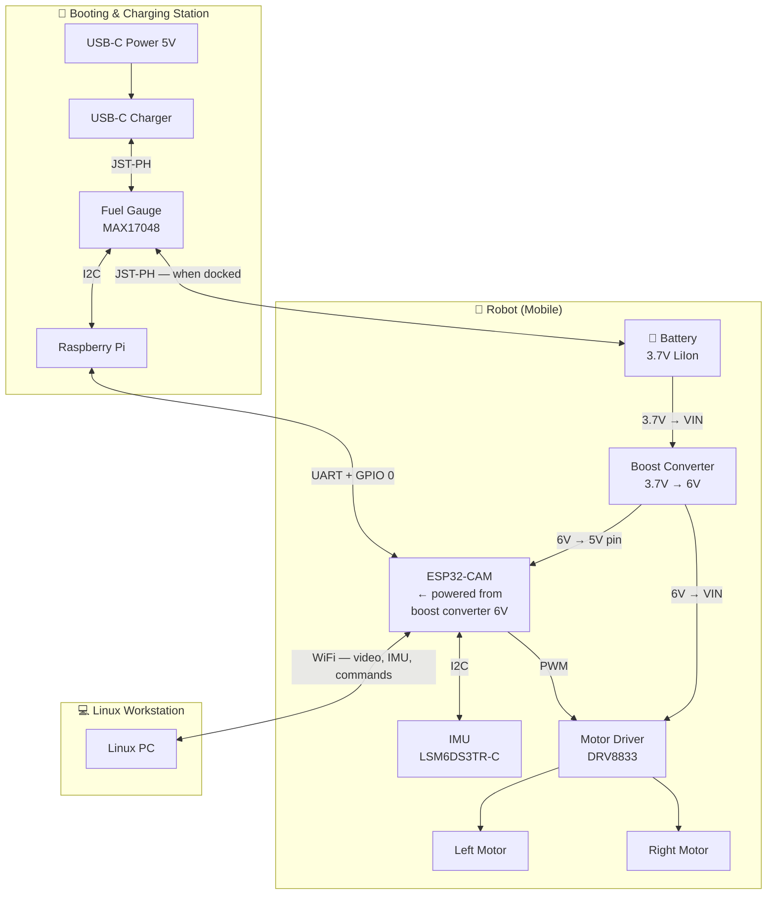

# ROSS — Robotic Operating Swarm System

A teleoperated mobile robot platform built around the ESP32-CAM. The robot streams live video and IMU data over WiFi while accepting motor commands from a Linux workstation. A Raspberry Pi serves as a booting and charging station, flashing firmware over UART and monitoring battery state.

## Overview

Three physically distinct subsystems:

| Subsystem | Hardware | Role |
|-----------|----------|------|
| **Robot** | ESP32-CAM, IMU, Motor Driver, Boost Converter, 2× Motors, LiIon Battery | Mobile platform — streams video and IMU data over WiFi; drives motors on command |
| **Linux Workstation** | Any Linux PC | Receives video + IMU over WiFi; runs teleoperation UI; sends velocity commands back |
| **Booting & Charging Station** | Raspberry Pi, Fuel Gauge, USB-C Charger | Flashes firmware onto ESP32 over UART; monitors battery; charges battery |



---

## Getting Started

### Prerequisites

- **Raspberry Pi** running Raspberry Pi OS (for flashing and charging)
- **Linux PC** (for teleoperation)
- **Hardware components** listed in the [Wiring](#wiring) section
- **Python 3.12** and [uv](https://docs.astral.sh/uv/)
- **PlatformIO** (`uv tool install platformio`)

### Quick Start

```bash
# 1. Clone and install Python dependencies
git clone <repo-url> && cd ROSS
uv sync

# 2. Configure WiFi credentials for the ESP32
make setup-env

# 3. Install PlatformIO and build firmware
uv tool install platformio
cd firmware && pio run && cd ..

# 4. Flash firmware to the ESP32-CAM (see Flashing section for UART setup)
uv run python ross/flash.py firmware/.pio/build/esp32cam/firmware.bin

# 5. After the ESP32 boots, it prints its IP to serial — open http://<ip> in a browser
```

---

## Project Structure

```
ROSS/
├── firmware/                  # ESP32-CAM firmware (C++ / PlatformIO)
│   ├── src/
│   │   ├── main.cpp           # HTTP server, WiFi, IMU, streaming
│   │   ├── camera.h / .cpp    # Camera driver
│   │   ├── motors.h           # DRV8833 PWM motor control
│   │   └── config.h           # Pin assignments, WiFi credential injection
│   ├── platformio.ini         # Build configuration and dependencies
│   └── load_env.py            # Pre-build script to load .env into firmware
├── ross/                      # Python package (Raspberry Pi utilities)
│   ├── flash.py               # Semi-automated firmware flashing over UART
│   ├── serial_test.py         # UART connectivity diagnostic
│   └── config.py              # Project paths and logging
├── docs/
│   └── esp32-cam-pinout.png   # Pinout reference diagram
├── pyproject.toml             # Python project metadata and dependencies
├── Makefile                   # setup-env helper
├── .env.sample                # WiFi credentials template
└── LICENSE                    # MIT
```

---

## Software

### Firmware (ESP32-CAM)

The firmware runs an HTTP server on port 80 that exposes the following endpoints:

| Endpoint | Method | Response | Description |
|----------|--------|----------|-------------|
| `/` | GET | HTML | Status page with links to other endpoints |
| `/stream` | GET | MJPEG | Live camera video stream |
| `/imu` | GET | JSON | Accelerometer, gyroscope, and temperature readings |
| `/motor?l=N&r=N` | GET | JSON | Set motor speeds (each -255 to 255) |
| `/stop` | GET | JSON | Stop both motors |

Source files in `firmware/src/`:

- **`main.cpp`** — WiFi connection, HTTP route handlers, IMU setup, MJPEG streaming loop
- **`camera.h` / `camera.cpp`** — OV2640 camera initialization and JPEG frame capture
- **`motors.h`** — PWM motor control for DRV8833 (forward, reverse, coast, brake)
- **`config.h`** — GPIO pin definitions, I2C address, PWM frequency, WiFi credentials (injected at build time from `.env`)

### Python Utilities

- **`ross/flash.py`** — Semi-automated flashing script. Controls GPIO 0 via `pinctrl` to toggle the ESP32 between flash and run modes. Prompts for manual RST button presses. Run `uv run python ross/flash.py --help` for usage.
- **`ross/serial_test.py`** — UART communication test harness for validating the serial link between the Pi and ESP32.
- **`ross/config.py`** — Loads `.env` and exposes `PROJ_ROOT`.

---

## Wiring

### Robot

#### Power

The battery feeds the boost converter, which supplies 6V to both the ESP32-CAM and the motor driver:

- **3.7 V** → Boost Converter **VIN** → **6V out** → ESP32-CAM **5V pin** (the onboard AMS1117 regulates down to 3.3V)
- **3.7 V** → Boost Converter **VIN** → **6V out** → Motor Driver **VIN**

| From | To | Wire |
|------|----|------|
| Battery JST-PH **+** (Red) | Boost Converter **VIN** | Red |
| Battery JST-PH **–** (Black) | Common ground bus | Black |
| Boost Converter **VOUT** | ESP32-CAM **5V pin** | Red — 6V rail |
| Boost Converter **VOUT** | DRV8833 **VIN** | Red — 6V rail |
| DRV8833 **GND** | Common ground bus | Black |
| ESP32-CAM **GND** | Common ground bus | Black |

> ⚠️ The boost converter has **no reverse-voltage protection**. Double-check polarity before applying power.

---

#### ESP32-CAM Pinout


GPIO 2, 12, 13, 14, and 15 are shared with the SD card interface. This wiring uses all of them for the IMU and motor driver, so **the SD card cannot be used in firmware** — do not call `SD.begin()`. A physical card can remain in the slot; the SD peripheral must stay uninitialized.

> ⚠️ **Strapping pins:** GPIO 0, 2, 12, and 15 are sampled at reset to select boot mode and flash voltage. See the [strapping pin notes](#strapping-pin-notes) below.

| GPIO | Assigned To | Notes |
|------|------------|-------|
| **GPIO 2** | IMU SDA | I2C data · ⚠️ strapping pin — must be LOW or floating to enter flash mode |
| **GPIO 3** (UART RX) | IMU SCL | Repurposed — UART RX only needed during flashing |
| **GPIO 12** | DRV8833 AIN1 | Left motor forward PWM · ⚠️ strapping pin — must be LOW at boot (see below) |
| **GPIO 13** | DRV8833 AIN2 | Left motor reverse PWM |
| **GPIO 14** | DRV8833 BIN1 | Right motor forward PWM |
| **GPIO 15** | DRV8833 BIN2 | Right motor reverse PWM · ⚠️ strapping pin (see below) |
| **GPIO 1** (UART TX) | Booting station RX | Flashing only |
| **GPIO 0** | Booting station GPIO | Boot mode control — LOW = flash mode |

> **GPIO 3 reuse:** During normal operation GPIO 3 is I2C SCL. The Raspberry Pi holds the line high-impedance when not flashing, so there is no conflict.

#### Strapping Pin Notes

GPIO 0, 2, 12, and 15 are **strapping pins** — the ESP32 samples them at reset to configure boot mode and flash voltage. In normal operation (after boot) they function as regular GPIOs.

| GPIO | Strapping Function | Required State at Boot | This Design |
|------|--------------------|----------------------|-------------|
| **GPIO 0** | Boot mode select | HIGH = run from flash, LOW = UART download mode | Controlled by RPi GPIO 17. Internal pull-up holds it HIGH when released. |
| **GPIO 2** | Must be LOW/floating for download mode | LOW or floating to enter download mode; ignored during normal boot (GPIO 0 HIGH) | Connected to IMU SDA. The IMU's I2C pull-up is weak enough that the pin reads LOW at reset — no conflict. If flashing fails, disconnect the IMU. |
| **GPIO 12** (MTDI) | Flash voltage select | LOW = 3.3V flash (default), HIGH = 1.8V flash | Connected to DRV8833 AIN1. The motor driver input floats LOW when unpowered, so this is safe. **Do not drive GPIO 12 HIGH before the ESP32 boots** — it will set the flash interface to 1.8V, causing boot failure on a 3.3V flash chip. |
| **GPIO 15** (MTDO) | Boot log output | HIGH = print boot messages on UART, LOW = silence boot messages | Connected to DRV8833 BIN2. If LOW at boot, UART boot messages are suppressed — not harmful, but may complicate debugging. |

---

#### IMU (LSM6DS3TR-C)

Connect using the STEMMA QT JST-SH 4-pin cable. The IMU has a STEMMA QT port; solder the bare end to the ESP32-CAM header.

| Cable Wire | ESP32-CAM Pin |
|-----------|---------------|
| Red (3.3V) | **3.3V** |
| Black (GND) | **GND** |
| Blue (SDA) | **GPIO 2** |
| Yellow (SCL) | **GPIO 3** |

**I2C address:** `0x6A` (default) — change to `0x6B` via solder jumper on the back of the board.

---

#### Motor Driver (DRV8833)

| DRV8833 Pin | Connect To | Notes |
|-------------|-----------|-------|
| **VIN** | Boost Converter VOUT (6V) | Motor supply |
| **GND** | Common ground | |
| **AIN1** | ESP32 GPIO 12 | Left motor — forward PWM |
| **AIN2** | ESP32 GPIO 13 | Left motor — reverse PWM |
| **BIN1** | ESP32 GPIO 14 | Right motor — forward PWM |
| **BIN2** | ESP32 GPIO 15 | Right motor — reverse PWM |
| **nSLEEP** | ESP32 3.3V | Tie HIGH to keep driver awake |
| **AOUT1** | Left motor cable Pin 6 (Red) | |
| **AOUT2** | Left motor cable Pin 5 (Black) | |
| **BOUT1** | Right motor cable Pin 6 (Red) | |
| **BOUT2** | Right motor cable Pin 5 (Black) | |
| **nFAULT** | Float, or 10 kΩ pull-up to 3.3V | Open-drain fault flag |
| **AISEN / BISEN** | GND | Tie to ground if current sense unused |

> ⚠️ DRV8833 is rated **1.2 A continuous per channel**. The motors stall at 1.5 A — avoid sustained stalls.

---

#### Motors (50:1 Micro Metal Gearmotor HPCB 6V)

Each motor uses the 6-pin JST SH-style encoder cable (#4762). Only pins 5 and 6 are needed for teleoperation; encoder pins are available for future closed-loop control.

| Cable Pin | Wire | Function | Connect To |
|-----------|------|----------|-----------|
| 1 | Green | Encoder GND | GND (if using encoders) |
| 2 | White | Encoder Ch. B | ESP32 GPIO (if using encoders) |
| 3 | Yellow | Encoder Ch. A | ESP32 GPIO (if using encoders) |
| 4 | Blue | Encoder Vcc | 3.3V (if using encoders) |
| **5** | **Black** | **Motor M2 –** | **DRV8833 AOUT2 / BOUT2** |
| **6** | **Red** | **Motor M1 +** | **DRV8833 AOUT1 / BOUT1** |

> To reverse a motor's direction, swap AOUT1 ↔ AOUT2 (or BOUT1 ↔ BOUT2) on the driver side, or invert PWM logic in firmware.

#### Motor Control Logic

| Command | AIN1 | AIN2 |
|---------|------|------|
| Forward | PWM duty cycle | LOW |
| Reverse | LOW | PWM duty cycle |
| Coast | LOW | LOW |
| Brake | HIGH | HIGH |

Apply the same logic to BIN1/BIN2 for the right motor.

---

### Booting & Charging Station

#### Battery Charging

The fuel gauge sits **in-line** between the battery and the charger, allowing the Raspberry Pi to monitor state of charge over I2C.

| Connection | Details |
|-----------|---------|
| Battery JST-PH → Fuel Gauge **JST-PH port 1** | Battery in |
| Fuel Gauge **JST-PH port 2** → Charger **VBAT** | Charger output |
| Charger **USB-C** → 5V USB power | Wall supply |
| Fuel Gauge **I2C + VIN** → Raspberry Pi | See table below |

**Fuel gauge I2C address:** `0x36`

| RPi Pin | Signal | MAX17048 Pin |
|---------|--------|--------------|
| Pin 1 | 3.3V | **VIN** |
| Pin 3 | GPIO 2 (SDA) | **SDA** |
| Pin 5 | GPIO 3 (SCL) | **SCL** |
| Pin 9 | GND | **GND** |

> When the robot is docked, unplug the battery JST-PH from the robot's boost converter and plug it into the fuel gauge input port.

---

#### UART Connections (for flashing)

Five wires between the Raspberry Pi and the ESP32-CAM header. No level shifter is needed — both operate at 3.3V logic. The Pi's 5V pin powers the ESP32-CAM during flashing, so no battery is needed.

| RPi Pin | Signal | ESP32-CAM Pin | Notes |
|---------|--------|---------------|-------|
| Pin 2 | 5V | **5V** | Powers ESP32-CAM during flashing |
| Pin 6 | GND | **GND** | Common ground |
| Pin 8 | GPIO 14 — UART TX | **GPIO 3 (RX)** | RPi transmits → ESP receives |
| Pin 10 | GPIO 15 — UART RX | **GPIO 1 (TX)** | ESP transmits → RPi receives |
| Pin 11 | GPIO 17 — output | **GPIO 0** | Drive LOW to enter flash mode |

> ⚠️ **Strapping pins during flashing:** GPIO 2, 12, and 15 are sampled at reset alongside GPIO 0. For the ESP32 to enter download mode successfully:
> - **GPIO 2** — must be LOW or floating. Connected to IMU SDA; disconnect the IMU if flashing fails.
> - **GPIO 12** — must be LOW (selects 3.3V flash voltage). Connected to DRV8833 AIN1; ensure the motor driver is unpowered so the pin floats LOW.
> - **GPIO 15** — if LOW at reset, UART boot messages are suppressed. Connected to DRV8833 BIN2; not harmful but may complicate debugging.

---

## Flashing

Firmware is flashed from the Raspberry Pi over UART using `esptool`. This requires the [UART connections](#uart-connections-for-flashing) above (which include 5V power from the Pi).

### Setup

#### 1. Install dependencies

```bash
uv sync
```

#### 2. Enable the hardware UART

```bash
sudo raspi-config
```

Navigate to `Interface Options → Serial Port`:
- Login shell over serial → **No**
- Serial port hardware enabled → **Yes**

If prompted to reboot, choose **No**.

#### 3. Grant serial port access, then reboot

```bash
sudo usermod -aG dialout $USER
sudo reboot
```

The reboot applies all changes and the new login picks up `dialout` group membership.

#### 4. Verify

```bash
ls -l /dev/ttyAMA0
```

- **File exists** — if you get "No such file or directory", the UART isn't enabled (redo raspi-config and reboot)
- **`dialout` group** — confirms your user has access

---

### Building Firmware

The firmware source lives in `firmware/` and is built with [PlatformIO](https://platformio.org/). WiFi credentials are read from a `.env` file in the repo root (gitignored) so they never end up in version control.

#### 1. Install PlatformIO

```bash
uv tool install platformio
```

> PlatformIO's venv may be missing `pip`, which causes package install failures. If you see `No module named pip`, fix it with:
> ```bash
> $(uv tool dir)/platformio/bin/python -m ensurepip
> ```

#### 2. Configure WiFi credentials

```bash
make setup-env
```

This copies `.env.sample` → `.env` and prompts you interactively:

```
  WIFI_SSID []: MyNetwork
  WIFI_PASS: ********
```

The password input is hidden. To reconfigure, delete `.env` and run again.

> **Tip:** You can use your laptop as a WiFi hotspot so the ESP32 and your workstation are on the same network:
> ```bash
> # Linux
> nmcli device wifi hotspot ssid ROSS password <pass>
> ```

#### 3. Build

```bash
cd firmware
pio run
```

Output binaries:
| File | Path |
|------|------|
| Application | `firmware/.pio/build/esp32cam/firmware.bin` |
| Bootloader | `firmware/.pio/build/esp32cam/bootloader.bin` |
| Partition table | `firmware/.pio/build/esp32cam/partitions.bin` |

---

### Flashing Sequence

The ESP32 enters flash mode when **GPIO 0 is held LOW during a reset**. The Raspberry Pi drives GPIO 17 (wired to ESP32 GPIO 0) to select the boot mode. The ESP32-CAM does not expose an RST pin on its header, so the RST button on the board must be pressed manually.

#### How to control GPIO pins from the Raspberry Pi

The `pinctrl` command (built into Raspberry Pi OS) reads and drives GPIO pins without any extra libraries:

```bash
# Drive GPIO 17 LOW (ESP32 enters flash mode on next reset)
pinctrl set 17 op dl    # op = output, dl = drive low

# Drive GPIO 17 HIGH (ESP32 boots normally on next reset)
pinctrl set 17 op dh    # op = output, dh = drive high

# Release GPIO 17 (return to default high-impedance input)
pinctrl set 17 ip       # ip = input (floating)
```

#### Manual flashing step-by-step

```
1. pinctrl set 17 op dl           → GPIO 0 = LOW (select flash mode)
2. Press and release RST on the ESP32-CAM board
3. Run the esptool command (see below)
4. pinctrl set 17 ip              → release GPIO 0 (internal pull-up restores HIGH)
5. Press and release RST again    → ESP32 boots normally
```

#### Semi-automated flashing script

The script `ross/flash.py` handles GPIO 0 control and runs esptool automatically. You only need to press the RST button when prompted — the script waits for you then handles everything else. See [flash.py](#flash-script-rossflashpy) below for details.

```bash
# Flash the application binary (writes to default address 0x10000)
uv run python ross/flash.py firmware/.pio/build/esp32cam/firmware.bin

# Erase flash first, then flash
uv run python ross/flash.py --erase firmware/.pio/build/esp32cam/firmware.bin

# Flash all partitions (bootloader + partition table + application)
uv run python ross/flash.py \
  0x1000:firmware/.pio/build/esp32cam/bootloader.bin \
  0x8000:firmware/.pio/build/esp32cam/partitions.bin \
  0x10000:firmware/.pio/build/esp32cam/firmware.bin

# Just check chip connectivity
uv run python ross/flash.py --chip-id
```

#### esptool commands (manual reference)

If you prefer to run `esptool` directly (after manually toggling GPIO 0 as shown above):

**Confirm chip is detected:**
```bash
uv run esptool --port /dev/ttyAMA0 --baud 115200 chip-id
```

**Erase flash (recommended before first flash):**
```bash
uv run esptool --port /dev/ttyAMA0 --baud 460800 erase-flash
```

**Flash the application binary:**
```bash
uv run esptool \
  --port /dev/ttyAMA0 \
  --baud 460800 \
  --chip esp32 \
  write-flash \
  --flash-mode dio \
  --flash-freq 40m \
  --flash-size detect \
  0x10000 firmware/.pio/build/esp32cam/firmware.bin
```

**Flash all partitions (PlatformIO build):**
```bash
uv run esptool \
  --port /dev/ttyAMA0 \
  --baud 460800 \
  --chip esp32 \
  write-flash \
  --flash-mode dio \
  --flash-freq 40m \
  --flash-size detect \
  0x1000  firmware/.pio/build/esp32cam/bootloader.bin \
  0x8000  firmware/.pio/build/esp32cam/partitions.bin \
  0x10000 firmware/.pio/build/esp32cam/firmware.bin
```

| Argument | Meaning |
|----------|---------|
| `--baud 460800` | Fast but reliable baud rate |
| `--flash-mode dio` | Dual I/O — correct for AI-Thinker ESP32-CAM |
| `--flash-freq 40m` | 40 MHz flash clock |
| `--flash-size detect` | Auto-detect (typically 4MB) |

#### Monitor serial output

```bash
uv run esptool --port /dev/ttyAMA0 --baud 115200 run
# or
screen /dev/ttyAMA0 115200  # Ctrl-A K to exit
```

---

### Flash Script (`ross/flash.py`)

Handles GPIO 0 control and esptool invocation automatically. Since the ESP32-CAM does not expose an RST pin on its header, the script prompts you to press the RST button twice:

1. **Before flashing** — script holds GPIO 0 LOW, you press RST to enter flash mode
2. **After flashing** — script releases GPIO 0, you press RST to boot the new firmware

See [usage examples](#semi-automated-flashing-script) above, or run `uv run python ross/flash.py --help`.

---

## Reference

### Cable & Connector Quick Reference

| Cable | Connector | Pitch | Pinout |
|-------|-----------|-------|--------|
| JST-PH 2-pin (#4714) | JST-PH | 2 mm | Pin 1 = Red (+), Pin 2 = Black (–) |
| STEMMA QT / Qwiic (#4210) | JST-SH 4-pin | 1 mm | Red = 3.3V, Black = GND, Blue = SDA, Yellow = SCL |
| Motor encoder cable (#4762) | JST-SH 6-pin | 1 mm | Green = Enc GND, White = Ch B, Yellow = Ch A, Blue = Enc Vcc, Black = M–, Red = M+ |

> ⚠️ STEMMA QT and motor encoder cables both use JST-SH 1mm connectors but have different pin counts. Do not interchange them.

### Operating Voltages

| Component | Power Input | Logic Level |
|-----------|------------|-------------|
| Battery | — | 3.7–4.2V output |
| Boost Converter | 3.7V in | 6V out |
| ESP32-CAM | 6V (5V pin, from boost converter) | 3.3V GPIO |
| IMU LSM6DS3TR-C | 3.3V (from ESP32) | 3.3V I2C |
| DRV8833 Motor Driver | 6V (from boost) | 3.3V inputs |
| Motors × 2 | 6V (from DRV8833) | — |
| Fuel Gauge MAX17048 | from battery | 3.3V I2C |
| Micro-Lipo Charger | 5V USB-C | — |
| Raspberry Pi | 5V USB-C | 3.3V GPIO |

### Common Pitfalls

| Pitfall | Prevention |
|---------|-----------|
| Boost converter has no reverse protection | Double-check battery polarity before first power-on |
| ESP32 not powered during flashing | The 5V wire from RPi Pin 2 powers the ESP32 — ensure it is connected |
| GPIO 0 floating at boot causes boot loop | Leave GPIO 0 unconnected during normal operation (internal pull-up holds it HIGH) |
| GPIO 12 HIGH at boot sets flash to 1.8V | Ensure motor driver is unpowered during boot — DRV8833 inputs float LOW when VIN is off |
| GPIO 2 HIGH at boot blocks download mode | Disconnect IMU if flashing fails — SDA pull-up may hold GPIO 2 HIGH |
| Motor stall current (1.5 A) exceeds DRV8833 limit (1.2 A) | Avoid sustained stalls |
| Encoder cable confused with STEMMA QT cable | Both use JST-SH 1mm — label cables |
| UART TX/RX swapped | RPi TX → ESP RX, RPi RX → ESP TX |
| Battery polarity reversed on aftermarket cells | Verify with multimeter before connecting |

---

## License

MIT License. See [LICENSE](LICENSE) for details.
