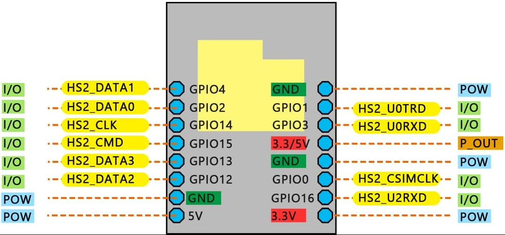

# ROSS — Robotic Operating Swarm System

A teleoperated mobile robot platform built around the ESP32-CAM. Currently streams live MJPEG video over WiFi. A Raspberry Pi serves as a flashing and charging station.

## Overview

| Subsystem | Hardware | Role |
|-----------|----------|------|
| **Robot** | ESP32-CAM, Battery, Boost Converter | Streams video over WiFi |
| **Station** | Raspberry Pi, Fuel Gauge, USB-C Charger | Flashes firmware over UART; monitors/charges battery |

Additional hardware (IMU, motor driver, motors) is wired but not yet enabled in firmware.

---

## Getting Started

### Prerequisites

- **Raspberry Pi** running Raspberry Pi OS
- **Python 3.12** and [uv](https://docs.astral.sh/uv/)
- **PlatformIO** (`uv tool install platformio`)

### Quick Start

```bash
# 1. Clone and install dependencies
git clone <repo-url> && cd ROSS
uv sync

# 2. Configure WiFi credentials
make setup-env

# 3. Build and flash
make deploy

# 4. Open http://<esp32-ip>/stream in a browser
```

---

## Project Structure

```
ROSS/
├── firmware/                  # ESP32-CAM firmware (C++ / PlatformIO)
│   ├── src/
│   │   ├── main.cpp           # HTTP server, WiFi, MJPEG streaming
│   │   ├── camera.h / .cpp    # Camera driver (isolated TU for sensor_t conflict)
│   │   ├── motors.h           # DRV8833 PWM motor control (not yet used)
│   │   └── config.h           # WiFi credential injection, stream settings
│   ├── platformio.ini         # Build configuration
│   └── load_env.py            # Pre-build script: .env → build flags
├── ross/                      # Python package (Raspberry Pi utilities)
│   ├── flash.py               # Semi-automated firmware flashing over UART
│   ├── config.py              # Project paths and logging
│   └── ...                    # Other utilities (teleop, fuel gauge, etc.)
├── docs/
│   └── esp32-cam-pinout.png   # Pinout reference diagram
├── Makefile                   # Build, flash, and dev targets
├── .env.sample                # WiFi credentials template
└── LICENSE                    # MIT
```

---

## Firmware

The firmware serves an HTTP server on port 80:

| Endpoint | Method | Response | Description |
|----------|--------|----------|-------------|
| `/` | GET | HTML | Status page |
| `/stream` | GET | MJPEG | Live camera video stream |

### Build & Flash

```bash
make setup-env   # Configure WiFi (first time only)
make build       # Build firmware
make deploy      # Build + flash
make serial      # Monitor serial output (Ctrl-A k to exit)
```

WiFi credentials are injected at build time from `.env` via `firmware/load_env.py`.

---

## Wiring

### Robot

#### Power

Battery → Boost Converter (3.7V → 6V) → ESP32-CAM 5V pin.

| From | To | Wire |
|------|----|------|
| Battery JST-PH **+** | Boost Converter **VIN** | Red |
| Battery JST-PH **–** | Common ground bus | Black |
| Boost Converter **VOUT** | ESP32-CAM **5V pin** | Red — 6V rail |
| ESP32-CAM **GND** | Common ground bus | Black |

> The boost converter has no reverse-voltage protection. Double-check polarity before applying power.

---

#### ESP32-CAM Pinout



| GPIO | Assigned To | Notes |
|------|------------|-------|
| **GPIO 2** | IMU SDA (future) | I2C data · strapping pin |
| **GPIO 3** (UART RX) | IMU SCL (future) | Repurposed after boot |
| **GPIO 12** | DRV8833 AIN1 (future) | Left motor forward · strapping pin |
| **GPIO 13** | DRV8833 AIN2 (future) | Left motor reverse |
| **GPIO 14** | DRV8833 BIN1 (future) | Right motor forward |
| **GPIO 15** | DRV8833 BIN2 (future) | Right motor reverse · strapping pin |
| **GPIO 1** (UART TX) | Station RX | Flashing only |
| **GPIO 0** | Station GPIO | Boot mode control |

#### Strapping Pin Notes

GPIO 0, 2, 12, and 15 are sampled at reset to configure boot mode and flash voltage.

| GPIO | Strapping Function | Required State at Boot | This Design |
|------|--------------------|----------------------|-------------|
| **GPIO 0** | Boot mode select | HIGH = run, LOW = flash | Controlled by RPi GPIO 17 |
| **GPIO 2** | Download mode | LOW or floating | IMU SDA pull-up is weak enough |
| **GPIO 12** | Flash voltage select | LOW = 3.3V | DRV8833 input floats LOW when unpowered |
| **GPIO 15** | Boot log output | HIGH = print boot messages | DRV8833 BIN2 may suppress boot messages if LOW |

---

### Station (Raspberry Pi)

#### UART Connections (for flashing)

| RPi Pin | Signal | ESP32-CAM Pin | Notes |
|---------|--------|---------------|-------|
| Pin 2 | 5V | **5V** | Powers ESP32 during flashing |
| Pin 6 | GND | **GND** | Common ground |
| Pin 8 | GPIO 14 — UART TX | **GPIO 3 (RX)** | RPi TX → ESP RX |
| Pin 10 | GPIO 15 — UART RX | **GPIO 1 (TX)** | ESP TX → RPi RX |
| Pin 11 | GPIO 17 — output | **GPIO 0** | LOW = flash mode |

#### Battery Charging

Fuel gauge (MAX17048) sits in-line between battery and charger. Pi monitors state of charge over I2C.

| RPi Pin | Signal | MAX17048 Pin |
|---------|--------|--------------|
| Pin 1 | 3.3V | **VIN** |
| Pin 3 | GPIO 2 (SDA) | **SDA** |
| Pin 5 | GPIO 3 (SCL) | **SCL** |
| Pin 9 | GND | **GND** |

---

## Flashing

### Semi-automated

```bash
make deploy
```

The script `ross/flash.py` controls GPIO 0 and runs esptool. You press RST when prompted.

### Manual

```bash
pinctrl set 17 op dl           # GPIO 0 LOW → flash mode
# Press RST on ESP32-CAM
uv run esptool --port /dev/ttyAMA0 --baud 460800 --chip esp32 \
  write_flash --flash_mode dio --flash_freq 40m --flash_size detect \
  0x10000 firmware/.pio/build/esp32cam/firmware.bin
pinctrl set 17 ip              # Release GPIO 0
# Press RST → ESP32 boots normally
```

### Setup (first time)

1. Enable hardware UART: `sudo raspi-config` → Interface Options → Serial Port → login shell **No**, hardware **Yes**
2. Grant serial access: `sudo usermod -aG dialout $USER && sudo reboot`
3. Verify: `ls -l /dev/ttyAMA0`

---

## License

MIT License. See [LICENSE](LICENSE) for details.
